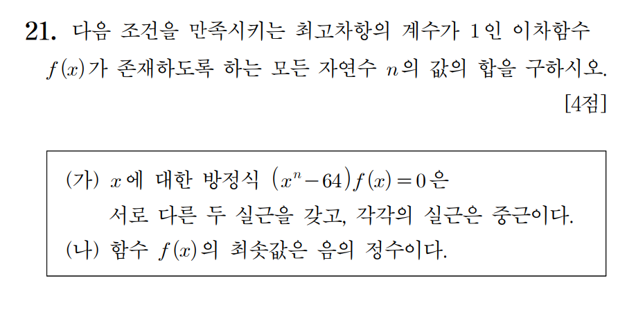

# [수능 수학 전략] 조건의 순서를 바꾸면 킬러 문제도 풀린다 (2022학년도 6월 21번)

수능 수학 고난도 문제를 마주했을 때 가장 강력한 무기는 지엽적인 공식이 아닙니다. 바로 **'문제 해석의 순서'**입니다. 많은 수험생이 지문에 적힌 순서대로 조건을 해석하려다 늪에 빠지곤 하지만, 고수들은 **조건의 선후 관계를 스스로 재설계**하여 복잡한 상황을 단칼에 정리합니다.

오늘은 **2022학년도 6월 모의평가 가형 21번** 문제를 통해 이 '조건 재배치' 전략을 어떻게 적용하는지 알아보겠습니다.

---

## 1. 문제 분석

**문제:** 다음 조건을 만족시키는 최고차항의 계수가 $1$인 이차함수 $f(x)$가 존재하도록 하는 모든 자연수 $n$의 값의 합을 구하시오. (4점)

* **(가)** $x$에 대한 방정식 $(x^n - 64)f(x) = 0$은 서로 다른 두 실근을 갖고, 각각의 실근은 중근이다.
* **(나)** 함수 $f(x)$의 최솟값은 음의 정수이다.

---

## 2. 전략적 접근: 왜 (나)부터 봐야 하는가?

보통 (가) 조건의 $x^n = 64$를 먼저 건드리면 $n$이 홀수일 때와 짝수일 때를 일일이 나누며 계산의 늪에 빠지기 쉽습니다. 하지만 **조건 (나)**를 먼저 보면 문제의 판도가 바뀝니다.

1.  **조건 (나) 선점:** $f(x)$는 최고차항이 $1$인 이차함수인데 최솟값이 음수입니다. 이는 $f(x) = 0$이 **서로 다른 두 실근**을 가짐을 즉시 의미합니다.
2.  **조건 (가) 결합:** 전체 방정식의 실근이 딱 2개뿐이고 모두 중근이어야 합니다. $f(x)$가 이미 2개의 실근을 가졌으므로, $x^n - 64 = 0$에서 나오는 실근들도 **정확히 $f(x)$의 실근과 일치**해야만 전체 실근 2개가 각각 중근이 될 수 있습니다.

---

## 3. 단계별 풀이

### Step 1: $n$의 성질 파악
$x^n = 64$가 서로 다른 두 실근을 가져야 하므로, **$n$은 반드시 짝수**여야 합니다. 만약 $n$이 홀수라면 실근이 1개뿐이라 중근 조건을 만족시킬 수 없습니다.

### Step 2: 실근의 일치
$x^n = 64$의 실근은 다음과 같습니다.
$$x = \pm 64^{1/n} = \pm 2^{6/n}$$
이차함수 $f(x)$는 이 두 근을 가져야 하므로 다음과 같이 식을 세울 수 있습니다.
$$f(x) = (x - 2^{6/n})(x + 2^{6/n}) = x^2 - 2^{12/n}$$

### Step 3: 최솟값 조건(나) 적용
$f(x)$의 최솟값은 꼭짓점($x=0$)에서의 함숫값인 $-2^{12/n}$입니다.
조건 (나)에 의해 이 값이 **음의 정수**여야 하므로, 지수인 $\frac{12}{n}$은 **자연수**가 되어야 합니다.

* $n$은 $12$의 약수 중 **짝수**인 값: $n = \{2, 4, 6, 12\}$

### Step 4: 정답 도출
모든 $n$의 값의 합은 다음과 같습니다.
$$2 + 4 + 6 + 12 = \mathbf{24}$$

---

## 💡 Insight: 조건의 주도권을 잡아라

문제 해설에서 보듯, **"조건의 이용 순서는 스스로 정하는 것"**입니다. 

* **(가)부터 풀 때:** $n$의 홀/짝 케이스 분류 $\rightarrow$ $f(x)$의 근의 개수 파악 $\rightarrow$ 복잡함 증가
* **(나)부터 풀 때:** $f(x)$의 개형 확정 $\rightarrow$ (가)의 상황 강제 $\rightarrow$ 직관적이고 깔끔한 풀이

수능 수학은 단순한 산수가 아니라, 주어진 단서들을 어떤 순서로 조합하여 상황을 **장악**하느냐의 싸움입니다. 무지성으로 위에서부터 읽기보다, **'어떤 조건이 상황을 가장 단순하게 만드는가'**를 먼저 고민해 보시기 바랍니다.