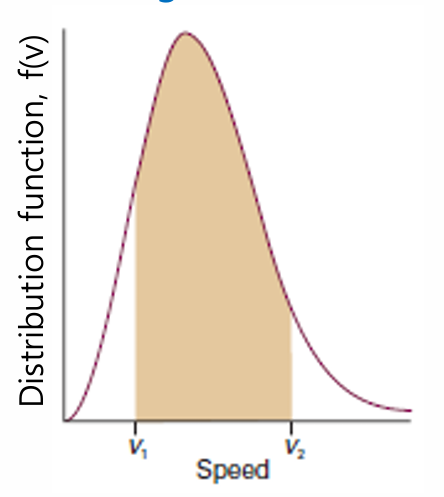

# TOPIC 1B The kinetic model

이번 단원에서는 기체분자의 운동을 서술할 것이다. 쉽게 말해서 기체 분자를 아주 작은 공 하나로 보고 우리가 고등학교 물리학 시간에 

배운 여러 고전역학 식들을 적용해서 표현해본다 라고 생각하면 받아 들이기 쉬울 것이다. 

## 1B.1 The model

일단 바로 역학식들을 적용하기에 앞서 3가지 가정을 하고 출발하자.

~~(영어로 적을건데 내가 영어 잘해요 이런게 아니라 엄밀성 때문이다.)~~

1. The gas consists of molecules of mass $m$ in ceaseless random motion obeying the laws of classical mechanics.

2. The size of the molecules is negligible, in the sense that their diameters are much smaller than average distance travelled          between collisions; they are 'point-like'.

3. The molecules interact only through brief elastic collisions.

   > - 1번은 말 그대로 질량 $m$을 가진 기체분자는 고전역학을 따르며 무작위로 움직인다이며 이때 무작위는 위치를 예측할 수 없음으로 받아들이자
   > - 2번은 원자 자체의 크기는 무시하고 점처럼 생각하자이다. 왜냐면 분자가 이동하는 거리대비 반지름이 너무 작아서이다.
   > - 3번은 만약 분자들이 충돌한다면 비탄성이 아닌, 탄성충돌 하자로 기억하자이다.

### 1B.1(a) Pressure and molecular speeds

우리는 앞에서 $PV=nRT$ 라는 식을 배웠다. 그런데 이 식을 분자운동론적 관점 즉 속도와 몰질량으로 바꾸어 적어볼 수 있다.

$$
PV=\frac{1}{3}nMv^{2}_{rms}
$$

여기서 중요한 점은 우리가 알던 EOS를 고전역학에서 사용하는 갯수,질량,속도의 변수로 바꾸어 작성할 수 있다는 점이다.

> 유도과정은 다른 게시물에 넣어놓겠다.

---

### 1B.1(b) The Maxwell-Boltzmann distribution of speeds

우리는 일상 생활에서 어떤 물체가 움직이는 정도를 보고 빠르네, 느리네 라고 바로 느낄 수 있다. 그런데 우리가 맨 눈으로 볼 수 없는 기체 분자들은 그럼 어떻게 속도를 가늠할 수 있을까? 이 답을 알려주는게 바로 **맥스웰 볼츠만 속도분포** 라고 이해하면 받아들이기 쉬울 것이다. 

위 사진에서 왼쪽은 2차원 공간에서 기체분자들의 운동을 시긱화 한 것이고 오은쪽은 특정 속도를 가지는 그 분자들의 비율을 표현한 것이다. 특이하게도 처음에는 무작위로 움직이던 분자들이 시간이 지남에따라 서로 충돌하고 벽에도 부딪히며 맥스윌 볼츠만 속도분포를 따르는 기이한 현상을 관찰 할 수 있다.

> 고등학교 확률과 통계시간에 배우는 확률밀도 함수이다.

#### **Maxwell-Boltzmann distribution**

$$
f(v) = \left( \frac{m}{2\pi k_B T} \right)^{3/2} 4\pi v^2 \exp\left( -\frac{mv^2}{2k_B T} \right)
$$

> 여기서 $f(v)$는 위 오른쪽 그래프의 y축 값인 확률밀도를 나타내며 $k_B$ 는 볼츠만 상수이다.
>
> 식의 유도는 여기서 하지 않겠다. 궁금한 학생은 추후 다른 게시물을 이용하자.

#### **Maxwell-Boltzmann distribution에서의 특징**

그래프의 특징은 살피고 넘어갈 필요가 있다. (그냥 식을 보고 특징을보고 아 그렇구나 할 정도로만 이해하자.)

① 가우시안 지수 감쇠 ($e^{-x^2}$)

- 방정식에 포함된 지수 함수는 $e^{-x^2}$ 꼴의 감쇠 함수입니다.
- 이 때문에 **속도가 지나치게 빠른($v$가 매우 큰) 분자의 비율은 극히 적습니다.**

② 몰질량($M$)의 영향

- 지수 항에 포함된 속도 곱해지는 인자는 $\frac{M}{2RT}v^2$ 형태를 띱니다.
- 분자량($M$)이 클수록 지수 항이 0을 향해 아주 급격하게 떨어집니다.
- **결론:** **무거운 분자**는 빠른 속도를 가질 확률이 희박합니다.

③ 온도($T$)의 영향

- 반대로 온도($T$)가 높으면 $\frac{M}{2RT}$ 항의 값이 작아집니다.
- 이로 인해 속도 $v$가 증가해도 지수 항이 0으로 떨어지는 속도가 상대적으로 느려집니다.
- **결론:** **고온**에서는 빠른 속도를 가진 분자들의 비율이 눈에 띄게 늘어납니다.

④ 속도 제곱 항($v^2$)의 역할

- 지수 함수 앞에는 $v^2$ 항이 곱해져 있습니다.
- 속도 $v$가 0에 가까워지면 $v^2$ 역시 0으로 수렴하므로, **질량과 관계없이 속도가 거의 0에 가까운 정지 상태의 분자 비율도 매우 적습니다.**

⑤ 정규화(Normalization) 상수

- 방정식 앞에 붙은 나머지 괄호 안의 항들과 $4\pi$는 **정규화 상수**입니다.
- 분자의 속도를 0부터 무한대($\infty$)까지 전체 구간에 대해 모두 더했을(적분했을) 때, **전체 확률의 총합이 1(100%)이 되도록** 보장해 주는 역할을 합니다.

---

### 1B.1(c) Mean values

여기서는 기체운동론에서 다루는 대푯값들을 소개한다.

들어가기에 앞서 간단한 상식하나 정리해보자 아래 사진을 보자.

Maxwell-Boltzmann distribution에서 속도 v1에서 v2까지 속도를 가지는 분자들의 비율을 나타낸다. 

이를 수식화하면 다음과 같다.
$$
F(v_1,v_2)= \int_{v_1}^{v_2} f(v) dv
$$
이제 여기서부터 
