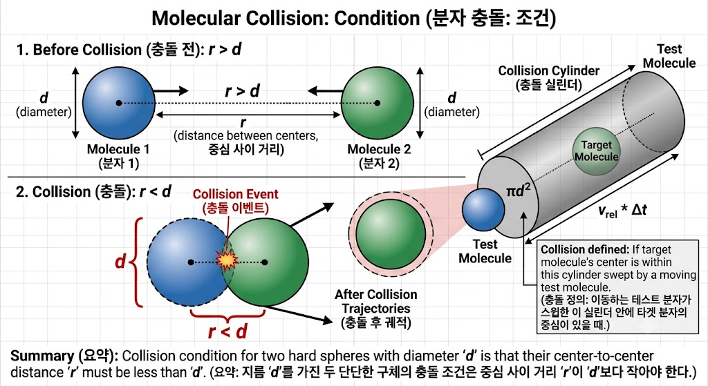

# TOPIC 1B The kinetic model

## 1B.2 Collision

이번 소단원에서는 앞 내용을 기반하여 실제 기제 분자들의 충돌에 관해 알아볼 것이다. 들어가기전 충돌에 대해 정의하자.

**collision(충돌)**: 같은 지름$d$를 가지는 분자 2개의 중심사이 거리가 $d$보다 작을때이다.

---

### 1B.2(a) The Collision frequency(충돌빈도)

말 그대로 충돌빈도는 충돌 횟수를 충돌 시간간격으로 나눈 값이다.
$$
\frac{충돌횟수}{충돌시간}=충돌빈도=z=\sigma v_{rel}
$$
